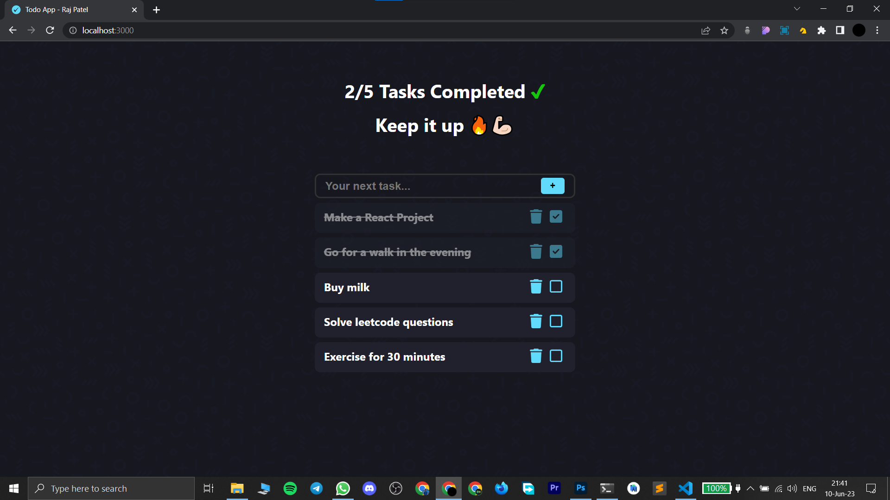
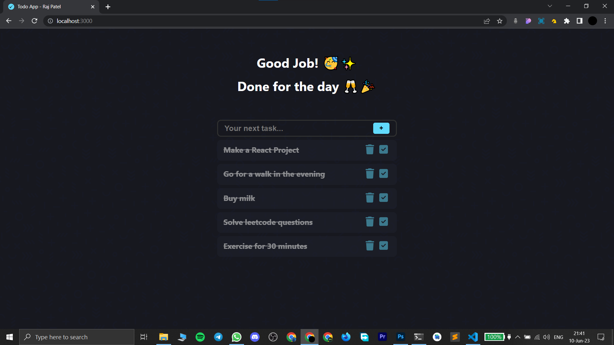

# Todo-App

### [Live Link](https://raj17ce-todo-app.netlify.app/)

#### This WebApp helps to add daily tasks and make a list out of it.

## Functionalities

- You can add daily tasks.

- You can mark the task as done.

- You can delete the task at anytime.

## TechStack

- [ReactJS](https://react.dev) for creating the single page UI.

- [Create React App](https://create-react-app.dev) for generating folder structure of the project.

- [Font Awesome](https://fontawesome.com) icon library for icons.

- JavaScript for logic implementation.

## ScreenShot

 

